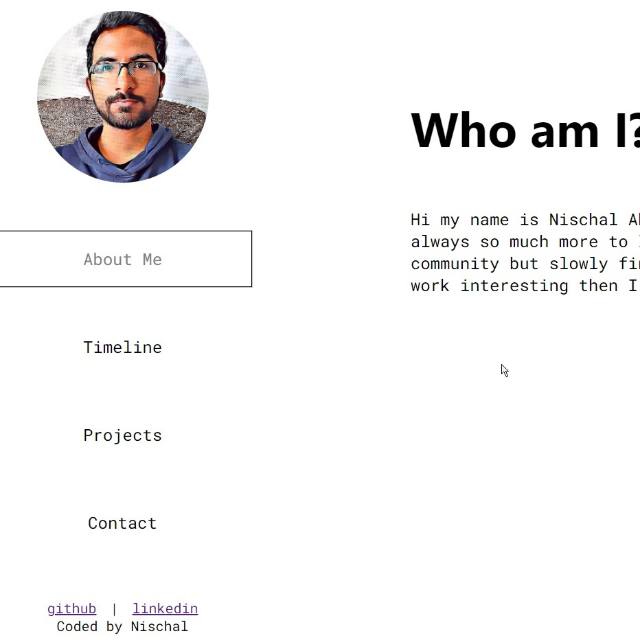
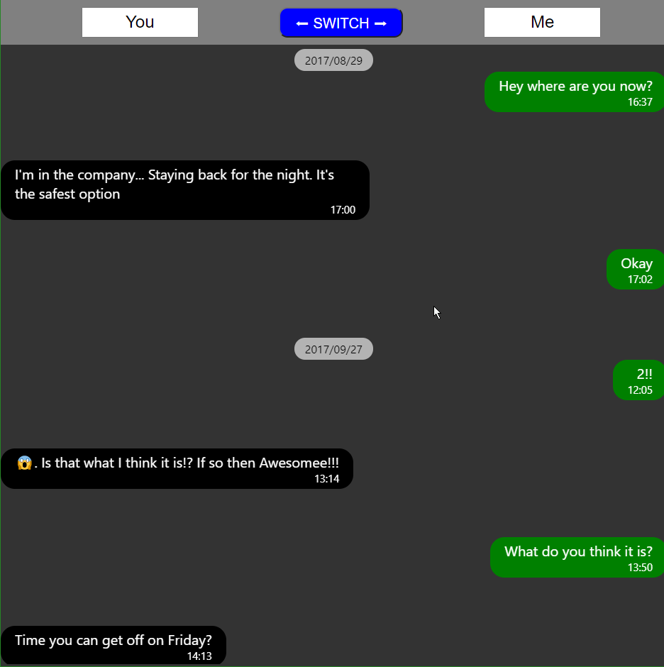
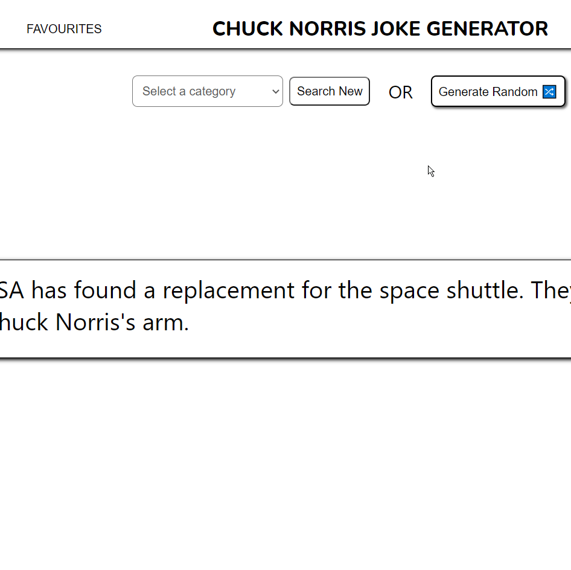
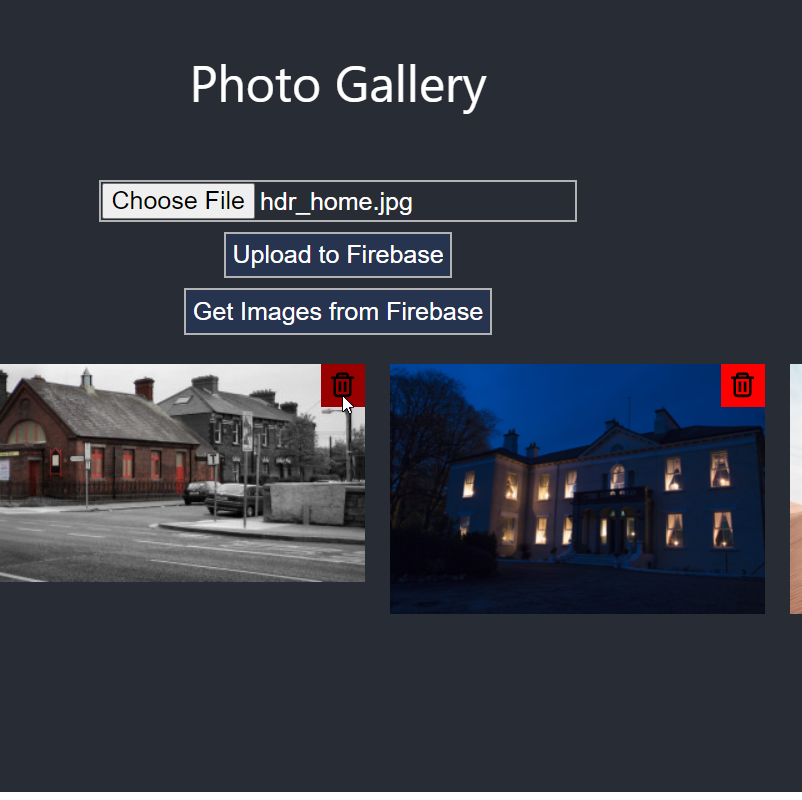

<h3 align="center">Curiosity killed the cat. It's a good thing I'm not a cat.</h3>

I've been studying computer science for more of my life than I've not been and I enjoy it just as much as I did when I started.

<h2>Current Goals 🎯</h2>

 On a journey to find practical application for the things I know and enjoy doing, which includes 
<ul><li>Finding a job</li><li>Looking for new projects</li></ul>
    

<h2 align="left">Connect with me 🛫</h3>

<h2 align="left">Languages and Tools I've Worked With 💻</h3>

  

&nbsp;

<h2>Currently Working On 🛠</h2>

Some projects I'm trying to improve right now are

| Portfolio Website | WhatsApp Reader | Chuck Norris Joke Generator | Photo Gallery |
| ------------------------------------------------------------------------------------------------------- | ----------------------------------------------------------------------------------------------------- | -------------------------------------------------------------------------------------------------------------- | ------------------------------------------------------------------------------------------------------------- |
|  |  |  |  |
| <a href="https://github.com/unknwnlistener/unknwnlistener.github.io">Repo</a> | <a href="https://github.com/unknwnlistener/whatsapp-reader">Repo</a> | <a href="https://github.com/unknwnlistener/chuck-norris-joke-generator">Repo</a> | <a href="https://github.com/unknwnlistener/photo-gallery">Repo</a> |
